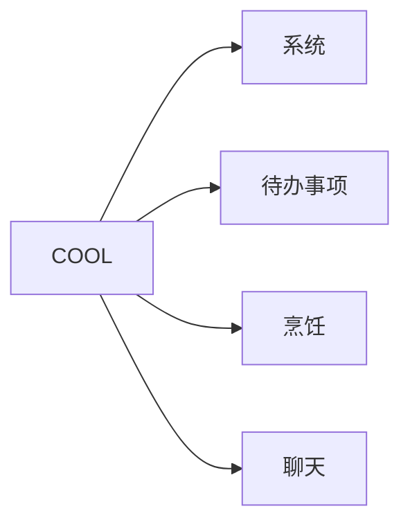

# COOL
该项目为一个简单的工具系统

## 项目结构

## 数据库设计
https://drawsql.app/teams/team-1662/diagrams/cool

## 技术选型
### 前端
todo
### 后端
| 技术          | 说明   | 官网  |
|-------------|------|-----|
| Spring Boot | 后端框架 | 123 |
