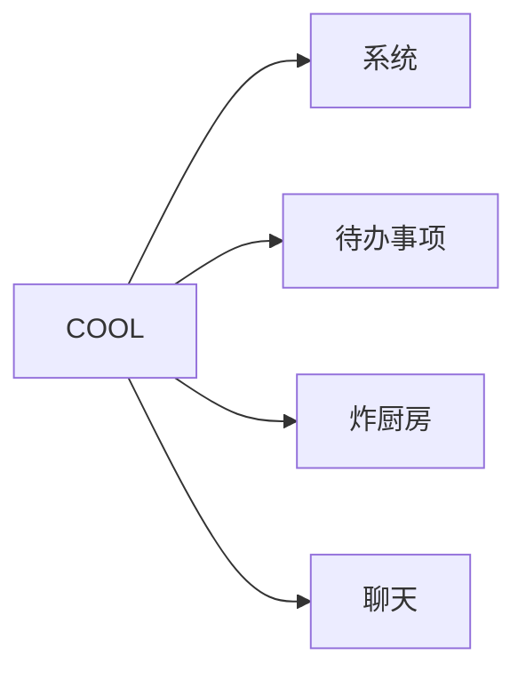

# COOL
该项目为一个简单的工具系统

## 已知问题
desktop无法运行

## 项目结构

## 数据库设计
https://drawsql.app/teams/team-1662/diagrams/cool

## 技术选型
Compose Multiplatform

前端学习遇到了一些瓶颈，准备重新技术选型至react+next.js

This is a Kotlin Multiplatform project targeting Android, iOS, Desktop, Server.

* `/server` is for the Ktor server application.

* `/shared` is for the code that will be shared between all targets in the project.
  The most important subfolder is `commonMain`. If preferred, you can add additional platform-specific folders here too.

* `/composeApp` is for code that will be shared across your Compose Multiplatform applications.
  It contains several subfolders:
  - `commonMain` is for code that’s common for all targets.
  - Other folders are for Kotlin code that will be compiled for only the platform indicated in the folder name.
    For example, if you want to use Apple’s CryptoKit for the iOS part of your Kotlin app,
    `iosMain` would be the right folder for such calls.

* `/iosApp` contains iOS applications. Even if you’re sharing your UI with Compose Multiplatform, 
  you need this entry point for your iOS app. This is also where you should add SwiftUI code for your project.

Learn more about [Kotlin Multiplatform](https://www.jetbrains.com/help/kotlin-multiplatform-dev/get-started.html)…